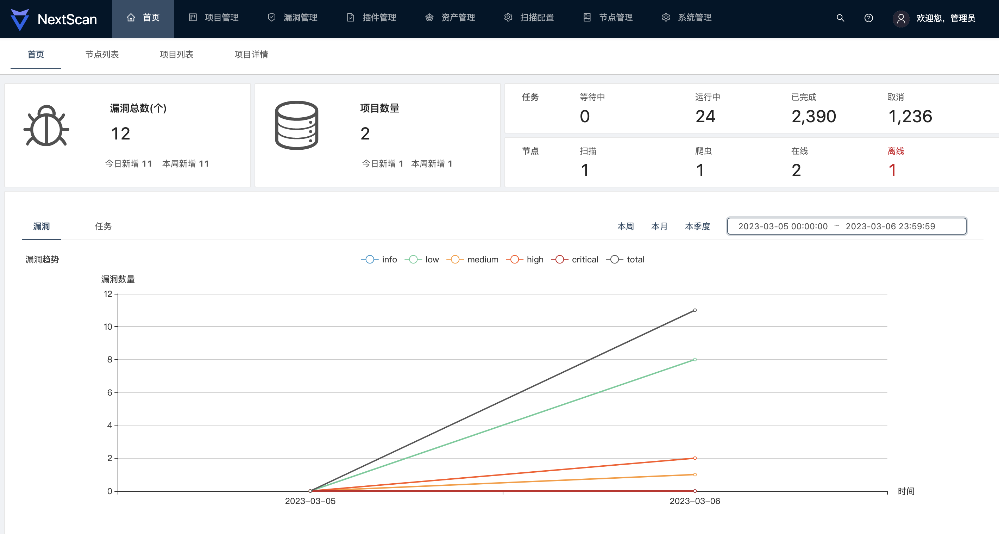

<h1 align="center">
  
</h1>

---

<h4 align="center">飞刃（NextScan）一款免费的企业级分布式安全评估系统。</h4>

飞刃（NextScan），是我们自研一款适合企业需求的漏洞扫描平台，基于go语言编写，采用分布式架构，由Server，Agent，Web三个部分组成。拥有信息采集、漏洞扫描、漏洞管理、POC管理、资产管理等功能，支持主动、被动多种扫描模式，支持多种数据来源，支持扫描Web漏洞、主机类漏洞；我们的愿景是希望打造成一个可以开箱即用的企业级黑盒漏洞扫描平台。

## NextScan优点

+ 全面高效：支持常见WEB漏洞扫描，以及Service漏洞扫描。 
+ 兼容nuclei：与Nuclei代码级深度集成，支持Nuclei 5000+ 高质量POC！ 
+ 智能爬虫：内置无头浏览器爬虫，不放过任意一个扫描目标。 
+ 分布式架构：支持节点横向扩展，大规模扫描速度没有上限。 
+ 安全可控：提供自主限速、限流设置，避免对目标系统造成影响，确保扫描过程安全可靠。 
+ 多源扫描：支持单URL/IP、被动式扫描（HTTP Proxy）、浏览器插件、动态爬虫、Kafka(流量、log)等多种扫描来源。 
+ 个性化配置：用户可以自由选择需要的插件和配置扫描策略和优先级，兼顾安全和高效。 
+ 轻松管理：完善的Web管理后台，提供友好的交互体验。 
+ 诞生于企业：更加懂得企业漏洞扫描场景，背后有专业产研团队以及安全专家提供技术支撑。

> 温馨提示：NextScan代码将择期开源。点个star，敬请期待🌟🌟🌟

## 安装指南

* [标准安装指南](https://next-scan.ly.com/install/binary/)
* [Docker安装指南](https://next-scan.ly.com/install/docker/)

⬇️[下载地址](https://github.com/tongcheng-security-team/NextScan/releases)

## 使用文档

**在使用之前，请务必阅读并同意 [免责声明](https://github.com/tongcheng-security-team/NextScan/blob/master/Disclaimer.md) 中的条款，否则请勿安装使用本工具。**

🏠[使用文档](https://next-scan.ly.com/user-guide/start/)  

## 系统展示

## 联系我们
<figure>
  <figcaption>官方群聊，欢迎进群交流</figcaption>
  
  <figcaption>加管理微信，拉你进群交流</figcaption>
  
  <figcaption>同程安全应急响应中心-公众号</figcaption>
  
</figure>

## 特别致谢
+ https://github.com/projectdiscovery/nuclei
+ https://github.com/projectdiscovery/katana

